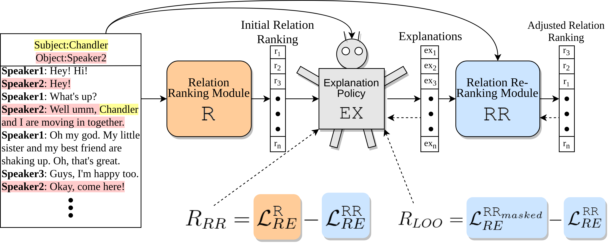
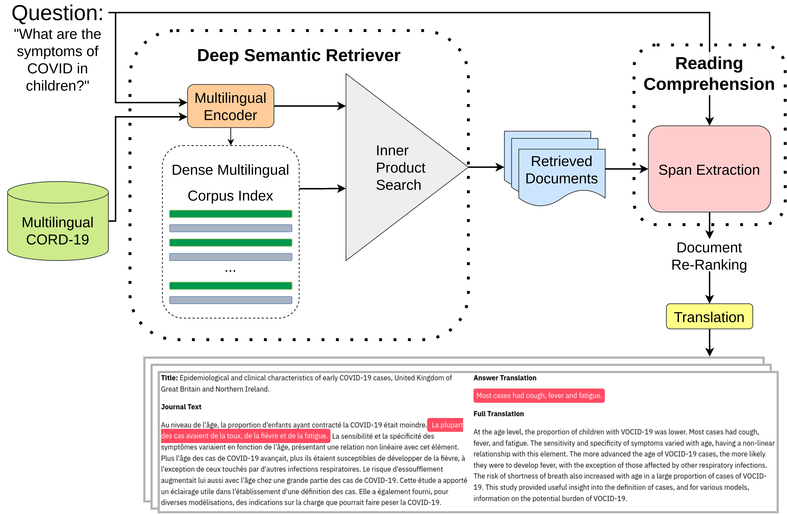


  You can also find my articles on <u><a href="{{author.googlescholar}}">my Google Scholar profile</a>.</u>




# 2022

* **FETA: A Benchmark for Few-Sample Task Transfer in Open-Domain Dialogue** \
<u>Alon Albalak</u>, Yi-Lin Tuan, Pegah Jandaghi, Connor Pryor, Luke Yoffe, Deepak Ramachandran, Lise Getoor, Jay Pujara, William Yang Wang\
**EMNLP 2022 Main Conference**, [Preprint](https://arxiv.org/abs/2205.06262) / [Code](https://github.com/alon-albalak/TLiDB) / [Benchmark Website](https://alon-albalak.github.io/feta-website/)

* **Data-Efficiency with a Single GPU: An Exploration of Transfer Methods for Small Language Models** \
<u>Alon Albalak</u>, Akshat Shrivastava, Chinnadhurai Sankar, Adithya Sagar, Mike Ross\
[Preprint](https://arxiv.org/abs/2210.03871)

* **Making Something out of Nothing: Building Robust Task-oriented Dialogue Systems from Scratch** \
Zekun Li, Hong Wang, <u>Alon Albalak</u>, Yingrui Yang, Jing Qian, Shiyang Li, Xifeng Yan\
**Alexa Prize Taskbot Challenge 2022**, [Paper](https://assets.amazon.science/80/f0/ad9a999f4562b6e80186a5df00e6/making-something-out-of-nothing-building-robust-task-oriented-dialogue-systems-from-scratch.pdf)

* **NeuPSL: Neural Probabilistic Soft Logic** \
Connor Pryor, Charles Dickens, Eriq Augustine, <u>Alon Albalak</u>, William Yang Wang, Lise Getoor\
[Preprint](https://arxiv.org/abs/2205.14268)

* **Emotion Recognition in Conversation using Probabilistic Soft Logic** \
Eric Augustine, Pegah Jandaghi, <u>Alon Albalak</u>, Connor Pryor, Charles Dickens, William Yang Wang, Lise Getoor\
[Preprint](https://arxiv.org/abs/2207.07238)

* **D-REX: Dialogue Relation Extraction with Explanations** \
<u>Alon Albalak</u>, Varun Embar, Yi-Lin Tuan, Lise Getoor, William Yang Wang\
**ConvAI Workshop, ACL 2022**, [Paper](https://aclanthology.org/2022.nlp4convai-1.4/) / [Code](https://github.com/alon-albalak/D-REX)

<!-- 

  
D-REX figure

  

-->

* **Efficient Learning Losses for Deep Hinge-Loss Markov Random Fields** \
Charles Dickens, Connor Pryor, Eriq Augustine, <u>Alon Albalak</u>, Lise Getoor\
**5th Workshop on Tractable Probabilistic Modeling**, [Paper](https://openreview.net/forum?id=8ZIJa8Z__5L) 

* **Addressing Issues of Cross-Linguality in Open-Retrieval Question Answering Systems For Emergent Domains** \
<u>Alon Albalak</u>, Sharon Levy, William Yang Wang\
[Preprint](https://arxiv.org/abs/2201.11153) / [Code](https://github.com/alon-albalak/XOR-COVID)

<!-- 

  
Figure

  

-->

# 2021

* **Modeling Disclosive Transparency in NLP Application Descriptions**\
Michael Saxon, Sharon Levy, Xinyi Wang, <u>Alon Albalak</u>, William Yang Wang\
**EMNLP 2021 Main Conference, Oral Presentation**, [Paper](https://aclanthology.org/2021.emnlp-main.153/)
